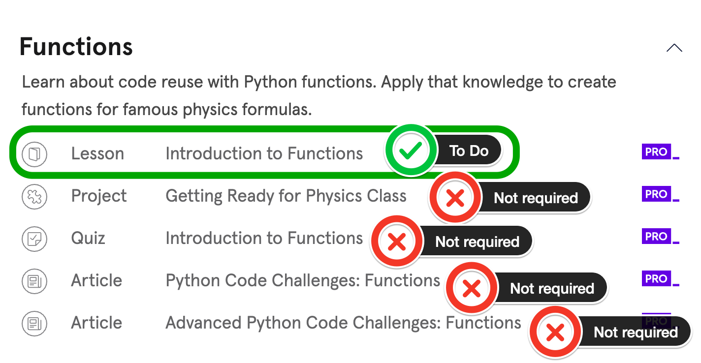

## Survey

1. Fill out the [pre-course survey](https://docs.google.com/forms/d/e/1FAIpQLSfkrEoTE2CCGmpnCCEJZBKr1ph8U4T9-2Muy90xWzVgiEIg6g/viewform?usp=sf_link). [~15 min]
2. Join the class [Slack](https://code4policy2021.slack.com/join/signup) chat. [~5 min]

## Coding Intro Assignment

Do the first "Lesson" for Sections 1-6 & 8 (Syntax, Functions, Control Flow, Lists, Loops, Strings and Dictionaries) of the [Codecademy Python3 Tutorial]((https://www.codecademy.com/learn/learn-python-3)). [~10 Hours] 

- This assignment will be due on **Sunday January 10** (a week into the course), but I'm providing it ahead of time because it is a substantial amount of work **may require a few hours spread across a few seatings to complete** in addition to other assignments you will get during the class.

-  **Knowing programming is not a prerequisite for this course**, but having experience with some of the basic concepts will help things move a little more smoothly. I will not be assuming prior knowledge for the class, so don't worry if its all new to you. If you are new to code however, it would be a good idea to start on these before the course begins to get a feel for things. Also note that while these are Python exercises, this isn't a Python class. We will encounter various technologies in the course, but these exercises should help you get in the groove of writing code.

- **The goal is not mastery, but familiarity.** These exercises will help you build the muscle memory of writing code (not misspelling commands, closing brackets you open, etc...) as well as some basic concepts (variables, lists, strings, logic). It will be easier to learn and use these concepts in class if you've encountered them before. The goal is to give you a sense of familiarity for when we work with code in the class. 

- **You only have to do the first "Lesson" within each section**. All the other sections, like (quizzes, projects, additonal lessons, etc.) are not required. See image below: 

	
	
	If you're stuck on a section, feel free to move onto the next section. You can also ask for help in the #python channel in Slack. If you get stuck, I'd rather you ask for help or just check out the next section instead of spending too much time trying to get un-stuck.

- **When you sign up for CodeCademy, you will get a 7-day free trial.** You can either complete the lessons within that trial period or pay for a one-month membership.

## Course Materials

* Computer: Mac, Linux or Windows 10. 
* Books
	* [Elements of Scrum](https://www.amazon.com/gp/product/B004O0U74Q/ref=oh_aui_d_detailpage_o00_?ie=UTF8&psc=1) by Chris Sims and Hillary Louise Johnson
	* [SCRUM: A Breathtaking Brief and Agile Introduction](https://www.amazon.com/Scrum-Breathtakingly-Brief-Agile-Introduction/dp/193796504X) by Chris Sims and Hillary Louise Johnson

	(Hint: I like to have these books handy as refernces, but if you want to save a few bucks, the Kindle editions of these books are cheaper than paperback and can be read electronically on your browser through the [kindle cloud reader](https://read.amazon.com/) even if you don't own a kindle.)